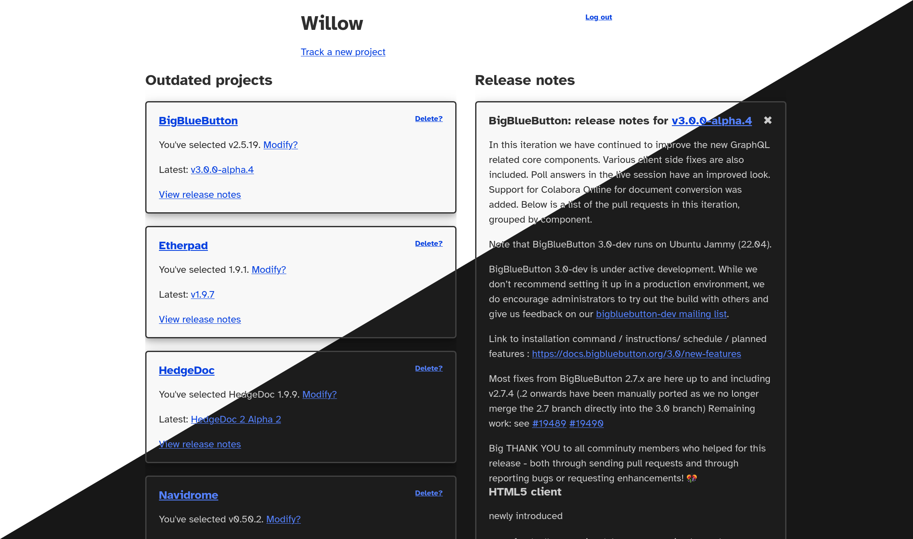

<!--
SPDX-FileCopyrightText: Amolith <amolith@secluded.site>

SPDX-License-Identifier: CC0-1.0
-->

# Willow

[![Go report card status][goreportcard-badge]][goreportcard]
[![REUSE status][reuse-shield]][reuse]
[![Donate with fosspay][fosspay-shield]][fosspay]

_Forge-agnostic software release tracker_



_This UI is Amolith's attempt at something simple and functional, yet still
friendly and pleasant. Amolith is not a UX professional and would **very** much
welcome input from one!_

## What is it?

_If you'd rather watch a short video, Amolith gave a 5-minute [lightning talk on
Willow] at the 2023 Ubuntu Summit._

[lightning talk on Willow]: https://youtu.be/XIGxKyekvBQ?t=29900

**Willow** helps developers, sysadmins, and homelabbers keep up with software
releases across arbitrary forge platforms, including full-featured forges like
GitHub, GitLab, or [Forgejo] as well as more minimal options like cgit or
[stagit].

[Forgejo]: https://forgejo.org/
[cgit]: https://git.zx2c4.com/cgit/
[stagit]: https://codemadness.org/stagit.html

**Willow** exists because decentralisation, as wonderful as it is, does have
some pain points. One piece of software is on GitHub, another piece is on
GitLab, one on Bitbucket, a fourth on [SourceHut], a fifth on the developer's
self-hosted Forgejo instance. The capabilities of each platform can differ as
well, making the problem even more difficult to solve. Forgejo and GitHub have
RSS feeds that notify you of releases as well as APIs. SourceHut has firehose
RSS feeds that notify you of _all_ activity in the repo plus an APIs. GitLab
only has an API. Some release announcements might be on the developer's personal
blog. Sometimes there's a CVE announcement prior to a release and those get
published on a different platform entirely.

[SourceHut]: https://sourcehut.org/

**Willow** brings all that scattered information under one roof by supporting
both RSS and one of the _very_ few things all the forges have in common: their
**V**ersion **C**ontrol **S**ystem. At the moment, [Git] is the _only_ supported
VCS, but we're definitely interested in adding support for Pijul, Fossil,
Mercurial, and potentially others.

[Git]: https://git-scm.com/
[Pijul]: https://pijul.org/
[Fossil]: https://www.fossil-scm.org/
[Mercurial]: https://www.mercurial-scm.org/

Amolith has recorded some of his other ideas, thoughts, and plans in [his wiki].

[my wiki]: https://wiki.secluded.site/hypha/willow

## Installation and use

_**Note:** prebuilt binaries will be available after we release [v0.0.1]_

[v0.0.1]: https://todo.sr.ht/~amolith/willow?search=status%3Aopen%20label%3A%22v0.0.1%22

* Clone the repo
* Build the binary with `CGO_ENABLED=0 go build -ldflags="-s -w" -o willow ./cmd`
* Upload it to a remote server
* Execute the binary
* Edit the `config.toml`
* Create a user with `./willow -a <username>`
* Execute the binary again
* Reverse proxy `http://localhost:1313`
* Open the web UI
* Click `Track new project`
* Fill out the form
* Indicate which version you're currently on
* That's it!

Note that we still consider the project to be in _alpha_ state. There _will_ be
bugs; please help fix them!

## Contributing

Contributions are very much welcome! Please take a look at the [ticket
tracker][todo] and see if there's anything you're interested in working on. If
there's specific functionality you'd like to see implemented and it's not
mentioned in the ticket tracker, please send a description to the [mailing
list][email] so we can discuss its inclusion. If we don't feel like it fits with
**Willow's** goals, you're encouraged to fork the project and make whatever
changes you like!

Questions, comments, and patches can always go to the [mailing list][email], but
there's also an [IRC channel][irc] and an [XMPP MUC][xmpp] for real-time
interactions.

- Email: [~amolith/willow@lists.sr.ht][email]
- IRC: [irc.libera.chat/#willow][irc]
- XMPP: [willow@muc.secluded.site][xmpp]

[email]: mailto:~amolith/willow@lists.sr.ht
[irc]: ircs://irc.libera.chat/#willow
[xmpp]: xmpp:willow@muc.secluded.site?join
[todo]: https://todo.sr.ht/~amolith/willow

_If you haven't used mailing lists before, please take a look at [SourceHut's
documentation](https://man.sr.ht/lists.sr.ht/), especially the etiquette
section._

### Configuring git...

…for <code>git send-email</code>

``` shell
git config sendemail.to "~amolith/willow@lists.sr.ht"
git config format.subjectPrefix "PATCH willow"
git send-email [HASH]
```

…for signing the [DCO]

``` shell
git config format.signOff yes
```

[DCO]: https://developercertificate.org/

### Required tools

- [Go](https://go.dev/)
- [gofumpt](https://github.com/mvdan/gofumpt)
  - Stricter formatting rules than the default `go fmt`
- [golangci-lint](https://golangci-lint.run/)
  - Aggregates various preinstalled Go linters, runs them in parallel, and makes
    heavy use of the Go build cache
- [Staticcheck](https://staticcheck.dev/)
  - Uses static analysis to find bugs and performance issues, offer
    simplifications, and enforce style rules

### Suggested tools

- [just](https://github.com/casey/just)
  - Command runner to simplify use of the required tools
- [air](https://github.com/cosmtrek/air)
  - Watches source files and rebuilds/executes the project when sources change

[goreportcard-badge]: https://goreportcard.com/badge/git.sr.ht/~amolith/willow
[goreportcard]: https://goreportcard.com/report/git.sr.ht/~amolith/willow
[reuse]: https://api.reuse.software/info/git.sr.ht/~amolith/willow
[reuse-shield]: https://shields.io/reuse/compliance/git.sr.ht/~amolith/willow
[fosspay]: https://secluded.site/donate/
[fosspay-shield]: https://shields.io/badge/donate-fosspay-yellow
