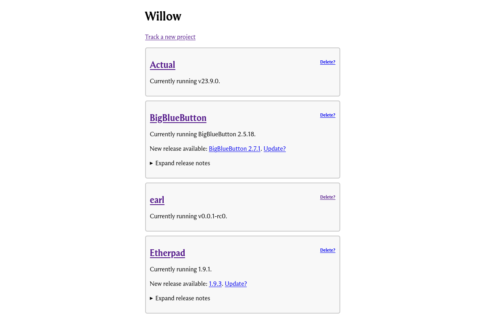

<!--
SPDX-FileCopyrightText: Amolith <amolith@secluded.site>

SPDX-License-Identifier: CC0-1.0
-->

# Willow

[![Go report card status][goreportcard-badge]][goreportcard]
[![REUSE status][reuse-shield]][reuse]
[![Donate with fosspay][fosspay-shield]][fosspay]

_Forge-agnostic software release tracker_



_This UI is a minimal proof-of-concept, it's going to change drastically in the
near future._

## What is it?

Willow tracks software releases across arbitrary forge platforms by trying to
support one of the very few things they all have in common: the VCS. At the
moment, git is the _only_ supported VCS, but I would be interested in adding
Pijul, Fossil, Mercurial, etc. You can also track releases using RSS feeds.

Willow exists because decentralisation can be annoying. One piece of software
can be found on GitHub, another piece on GitLab, one on Bitbucket, a fourth on
SourceHut, and a fifth on the developer's self-hosted Forgejo instance. Forgejo
and GitHub have RSS feeds that only notify you of releases. GitLab doesn't
support RSS feeds for anything, just an API you can poke. Some software updates
might be on the developers' personal blog. Sometimes there are CVEs for specific
software and they get published somewhere completely different before they're
fixed in a release.

I want to bring all that scattered information under one roof so a developer or
sysadmin can pop open willow's web UI and immediately see what needs updating
where. I've recorded some of my other ideas and plans in [my wiki].

[my wiki]: https://wiki.secluded.site/hypha/willow

## Installation and use

* Clone the repo
* Build the binary with `CGO_ENABLED=0 go build -ldflags="-s -w" -o willow ./cmd`
* Upload it to a remote server
* Execute the binary
* Edit the `config.toml`
* Create a user with `./willow -a <username>`
* Execute the binary again
* Reverse proxy `http://localhost:1313`
* Open the web UI
* Click `Track new project`
* Fill out the form
* Indicate which version you're currently on
* That's it!

Note that I still consider the project to be in _alpha_ state. There will be
bugs; please help fix them!

## Contributing

Contributions are very much welcome! Please take a look at the [ticket
tracker][todo] and see if there's anything you're interested in working on. If
there's specific functionality you'd like to see implemented and it's not
mentioned in the ticket tracker, please post to the [mailing list][email] and
describe the feature.

Questions, comments, and patches can always be sent to the [mailing
list][email], but I'm also in the [IRC channel][irc]/[XMPP room][xmpp] pretty
much 24/7. However, I might not see messages right away because I'm working on
something else (or sleeping) so please stick around.

If you're wanting to introduce a new feature and I don't feel like it fits with
this project's goal, I encourage you to fork the repo and make whatever changes
you like!

- Email: [~amolith/willow@lists.sr.ht][email]
- IRC: [irc.libera.chat/#willow][irc]
- XMPP: [willow@muc.secluded.site][xmpp]

[email]: mailto:~amolith/willow@lists.sr.ht
[irc]: irc://irc.nixnet.services/#willow
[xmpp]: xmpp:willow@muc.secluded.site?join
[todo]: https://todo.sr.ht/~amolith/willow

_If you haven't used mailing lists before, please take a look at [SourceHut's
documentation](https://man.sr.ht/lists.sr.ht/), especially the etiquette
section._

### Required tools

- [Go](https://go.dev/)
- [gofumpt](https://github.com/mvdan/gofumpt)
  - Stricter formatting rules than the default `go fmt`
- [golangci-lint](https://golangci-lint.run/)
  - Aggregates various preinstalled Go linters, runs them in parallel, and makes
    heavy use of the Go build cache
- [Staticcheck](https://staticcheck.dev/)
  - Uses static analysis to find bugs and performance issues, offer
    simplifications, and enforce style rules

### Suggested tools

- [just](https://github.com/casey/just)
  - Command runner to simplify use of the required tools
- [air](https://github.com/cosmtrek/air)
  - Watches source files and rebuilds/executes the project when sources change

### Configuring git for git send-email

First, go through the tutorial on
[git-send-email.io](https://git-send-email.io/).

``` shell
git config sendemail.to "~amolith/willow@lists.sr.ht"
```

[goreportcard-badge]: https://goreportcard.com/badge/git.sr.ht/~amolith/willow
[goreportcard]: https://goreportcard.com/report/git.sr.ht/~amolith/willow
[reuse]: https://api.reuse.software/info/git.sr.ht/~amolith/willow
[reuse-shield]: https://shields.io/reuse/compliance/git.sr.ht/~amolith/willow
[fosspay]: https://secluded.site/donate/
[fosspay-shield]: https://shields.io/badge/donate-fosspay-yellow
